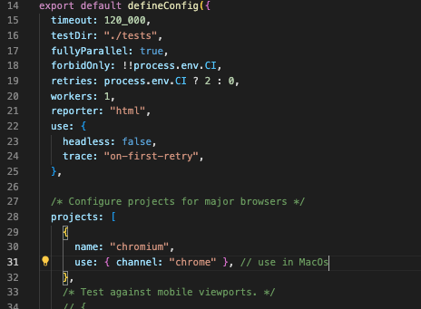
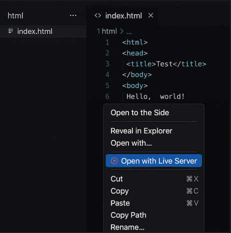

<!-- Badges: START -->
<p align="center">
  <a href="https://github.com/jamesonbatista/playwright-plugin-web-from-json"></a>
  <a href="https://www.npmjs.com/package/playwright-plugin-web-from-json"></a>
  
  
  
</p>
<!-- Badges: END -->

# ✨ Playwright Web-from-JSON

```cmd
npm init --y
npm init playwright
npm i playwright-plugin-web-from-json
```

## Use recomended config in `playwright.config.ts`

## 

## 🚀 Running the Test HTML

To run the test HTML:

1. **Install the Live Server extension** in VS Code.
2. Open the file: `html/index.html`
3. Right-click anywhere in the file.
4. Select **"Open with Live Server"**.

💡 This will automatically open the page in your default browser

---

### 🖼️ Example: Opening with Live Server



> If you don’t see this option, make sure the **Live Server** extension is properly installed and enabled in VS Code.

---

### Using `url`

```json
{ "url": "https..." } // absolute url

{ "url": "/products" } // baseUrl (playwright.config.ts) + /products

{  } // to continue automation on the current page, do not use the key url

```

---

<!-- Actions Reference → Playwright (compact HTML table for README) -->
<style>
  /* Scope styles so they don't leak */
  .actions-ref { font-family: ui-sans-serif, system-ui, -apple-system, Segoe UI, Roboto, Helvetica, Arial, "Apple Color Emoji","Segoe UI Emoji"; }
  .actions-ref h2 { font-size: 16px; margin: 8px 0 10px; font-weight: 700; }
  .actions-ref .table-wrap { overflow-x: auto; }
  .actions-ref table { width: 100%; border-collapse: collapse; font-size: 12px; line-height: 1.35; table-layout: fixed; }
  .actions-ref th, .actions-ref td { border: 1px solid #e5e7eb; padding: 8px; vertical-align: top; }
  .actions-ref th {  text-align: left; font-weight: 700; }
  .actions-ref code { font-family: ui-monospace, SFMono-Regular, Menlo, Monaco, Consolas, "Liberation Mono", monospace; font-size: 11px; padding: 2px 4px; border-radius: 4px; }
  .actions-ref .cell pre { margin: 0; white-space: pre-wrap; word-wrap: break-word; }
  .actions-ref .muted { color: #6b7280; }
  code {justify-content: center; align-items: center; display: flex;}
  td {justify-content: center; align-items: center}
</style>

<div class="actions-ref">
  <h2>🛠️ Actions Reference → Playwright</h2>
  <div class="table-wrap">
    <table>
      <thead>
        <tr>
          <th style="width:140px;">Action</th>
          <th>JSON (2 examples)</th>
          <th>Playwright reference (2 examples)</th>
        </tr>
      </thead>
      <tbody>
        <tr>
          <td><code>type</code></td>
          <td class="cell"><pre><code>{ "loc": "#user", "type": "John" }
{ "loc": "input[name='email']", "type": "jam@example.com" }</code></pre></td>
          <td class="cell"><pre><code>await page.locator('#user').fill('John')
await page.locator('input[name="email"]').fill('jam@example.com')</code></pre></td>
        </tr>
        <tr>
          <td><code>typeSlow</code></td>
          <td class="cell"><pre><code>{ "loc": "#msg", "typeSlow": "Hello" }
{ "loc": ".editor textarea", "typeSlow": "Long text…" }</code></pre></td>
          <td class="cell"><pre><code>await loc.fill(''); await loc.pressSequentially('Hello', { delay: 300 })
await page.locator('.editor textarea').pressSequentially('Long text…', { delay: 300 })</code></pre></td>
        </tr>
        <tr>
          <td><code>click</code></td>
          <td class="cell"><pre><code>{ "click": "button > Save" }
{ "click": "a:has-text('Docs')" }</code></pre></td>
          <td class="cell"><pre><code>await page.locator('button', { hasText: 'Save' }).click()
await page.locator("a:has-text('Docs')").click()</code></pre></td>
        </tr>
        <tr>
          <td><code>click: "{type}"</code></td>
          <td class="cell"><pre><code>{ "loc": "#q", "type": "Playwright" }, { "click": "{type}" }
{ "type": "Neo", "loc": "input[name='who']" }, { "click": "{type}" }</code></pre></td>
          <td class="cell"><pre><code>await page.locator('#q').fill('Playwright'); await page.getByText('Playwright', { exact: true }).click()
await page.locator("input[name='who']").fill('Neo'); await page.getByText('Neo', { exact: true }).click()</code></pre></td>
        </tr>
        <tr>
          <td><code>click: "&lt;prefix&gt; {type}"</code></td>
          <td class="cell"><pre><code>{ "type": "Item 1", "loc": "#search" }, { "click": "ul.results {type}" }
{ "type": "Settings", "loc": "#menu-filter" }, { "click": "nav {type}" }</code></pre></td>
          <td class="cell"><pre><code>await page.locator('#search').fill('Item 1'); await page.locator('ul.results *:has-text("Item 1")').click()
await page.locator('#menu-filter').fill('Settings'); await page.locator('nav *:has-text("Settings")').click()</code></pre></td>
        </tr>
        <tr>
          <td><code>hover</code></td>
          <td class="cell"><pre><code>{ "hover": ".menu" }
{ "hover": "button:has-text('Preview')" }</code></pre></td>
          <td class="cell"><pre><code>await page.locator('.menu').hover()
await page.locator("button:has-text('Preview')").hover()</code></pre></td>
        </tr>
        <tr>
          <td><code>press</code></td>
          <td class="cell"><pre><code>{ "press": "Enter", "loc": "#q" }
{ "press": "Escape" }</code></pre></td>
          <td class="cell"><pre><code>await page.locator('#q').press('Enter')
await page.keyboard.press('Escape')</code></pre></td>
        </tr>
        <tr>
          <td><code>check</code> / <code>uncheck</code></td>
          <td class="cell"><pre><code>{ "check": "#agree" }
{ "uncheck": ".todo-list li:nth-child(1) .toggle" }</code></pre></td>
          <td class="cell"><pre><code>await page.locator('#agree').check()
await page.locator('.todo-list li:nth-child(1) .toggle').uncheck()</code></pre></td>
        </tr>
        <tr>
          <td><code>select</code></td>
          <td class="cell"><pre><code>{ "select": { "label": "Brazil" }, "loc": "#country" }
{ "select": { "value": "us" }, "loc": "select#country" }</code></pre></td>
          <td class="cell"><pre><code>await page.locator('#country').selectOption({ label: 'Brazil' })
await page.locator('select#country').selectOption({ value: 'us' })</code></pre></td>
        </tr>
        <tr>
          <td><code>upload</code></td>
          <td class="cell"><pre><code>{ "upload": { "loc": "input[type=file]", "files": ["fixtures/a.png"] } }
{ "upload": { "loc": "input[type=file]", "files": ["fixtures/a.png","fixtures/b.png"] } }</code></pre></td>
          <td class="cell"><pre><code>await page.locator('input[type=file]').setInputFiles('fixtures/a.png')
await page.locator('input[type=file]').setInputFiles(['fixtures/a.png','fixtures/b.png'])</code></pre></td>
        </tr>
        <tr>
          <td><code>exist</code></td>
          <td class="cell"><pre><code>{ "exist": "#close-popup", "click": "#close-popup" }
{ "exist": "Promotion", "click": "Fechar" }</code></pre></td>
          <td class="cell"><pre><code>/* Soft-check element then run remaining keys if found */
 /* Soft-check text then click close */</code></pre></td>
        </tr>
        <tr>
          <td><code>getText</code></td>
          <td class="cell"><pre><code>{ "getText": "h1" }
{ "getText": ".card .title" }</code></pre></td>
          <td class="cell"><pre><code>const t = await page.locator('h1').textContent()
const t2 = await page.locator('.card .title').textContent()</code></pre></td>
        </tr>
        <tr>
          <td><code>expectText</code></td>
          <td class="cell"><pre><code>{ "expectText": { "contains": "Welcome" } }
{ "loc": ".toast", "expectText": { "equals": "Saved!" } }</code></pre></td>
          <td class="cell"><pre><code>await expect(page.locator('body')).toContainText('Welcome')
await expect(page.locator('.toast')).toHaveText('Saved!')</code></pre></td>
        </tr>
        <tr>
          <td><code>expectVisible</code></td>
          <td class="cell"><pre><code>{ "expectVisible": "#toast" }
{ "loc": ".modal", "expectVisible": { "timeout": 2000 } }</code></pre></td>
          <td class="cell"><pre><code>await expect(page.locator('#toast')).toBeVisible()
await expect(page.locator('.modal')).toBeVisible({ timeout: 2000 })</code></pre></td>
        </tr>
        <tr>
          <td><code>expectUrl</code></td>
          <td class="cell"><pre><code>{ "expectUrl": { "contains": "/home" } }
{ "expectUrl": { "equals": "https://app.test/dashboard" } }</code></pre></td>
          <td class="cell"><pre><code>await expect(page).toHaveURL(/\/home/)
await expect(page).toHaveURL('https://app.test/dashboard')</code></pre></td>
        </tr>
        <tr>
          <td><code>waitRequest</code></td>
          <td class="cell"><pre><code>{ "waitRequest": { "url": "/api/save", "status": 200 } }
{ "waitRequest": { "url": "**/users", "method": "POST" } }</code></pre></td>
          <td class="cell"><pre><code>await handleWaitRequest(page, { url:'/api/save', status:200 })
await handleWaitRequest(page, { url:'**/users', method:'POST' })</code></pre></td>
        </tr>
        <tr>
          <td><code>wait</code></td>
          <td class="cell"><pre><code>{ "wait": 500 }
{ "wait": 1500 }</code></pre></td>
          <td class="cell"><pre><code>await page.waitForTimeout(500)
await page.waitForTimeout(1500)</code></pre></td>
        </tr>
        <tr>
          <td><code>screenshot</code></td>
          <td class="cell"><pre><code>{ "screenshot": { "path": "shots/home.png", "fullPage": true } }
{ "loc": ".card", "screenshot": { "path": "shots/card.png" } }</code></pre></td>
          <td class="cell"><pre><code>await page.screenshot({ path:'shots/home.png', fullPage:true })
await page.locator('.card').screenshot({ path:'shots/card.png' })</code></pre></td>
        </tr>
        <tr>
          <td><code>forEach</code></td>
          <td class="cell"><pre><code>{ "forEach": { "items": ".product-card", "actions": [ { "click": "button:has-text('Details')" } ] } }
{ "forEach": { "items": "article.post", "actions": [ { "getText": "h2.title" } ] } }</code></pre></td>
          <td class="cell"><pre><code>/* Iterate matched items and run nested actions */</code></pre></td>
        </tr>
        <tr>
          <td><code>scrollTo</code></td>
          <td class="cell"><pre><code>"bottom"
{ "to": "h2:has-text('Installation')" }</code></pre></td>
          <td class="cell"><pre><code>await page.evaluate(() => window.scrollTo({ top: document.body.scrollHeight }))
await page.locator("h2:has-text('Installation')").scrollIntoViewIfNeeded()</code></pre></td>
        </tr>
        <tr>
          <td><code>expectValue</code></td>
          <td class="cell"><pre><code>{ "expectValue": { "loc": "input[name='email']", "equals": "jam@example.com" } }
{ "expectValue": { "loc": "#q", "contains": "runner" } }</code></pre></td>
          <td class="cell"><pre><code>await expect(page.locator("input[name='email']")).toHaveValue("jam@example.com")
expect(await page.locator('#q').inputValue()).toContain('runner')</code></pre></td>
        </tr>
        <tr>
          <td><code>route</code></td>
          <td class="cell"><pre><code>{ "route": { "url": "**/api/users", "mock": { "status": 200, "json": [{ "id":1,"name":"Neo"}] } } }
{ "route": { "unroute": "**/api/users" } }</code></pre></td>
          <td class="cell"><pre><code>await page.route("**/api/users", r =&gt; r.fulfill({ status:200, headers:{'content-type':'application/json'}, body: JSON.stringify([{id:1,name:'Neo'}]) }))
await page.unroute("**/api/users")</code></pre></td>
        </tr>
        <tr>
          <td><code>run</code></td>
          <td class="cell"><pre><code>{ "run": "buildUser" }
{ "run": "nowISO" }</code></pre></td>
          <td class="cell"><pre><code>/* Executes plugin function RunPluginFunctions.buildUser() / nowISO() */</code></pre></td>
        </tr>
      </tbody>
    </table>
  </div>
  <p class="muted">Tip: você pode ajustar <code>font-size</code> nas regras acima (12px / 11px) se quiser ainda menor.</p>
</div>

### ✅ Complete context example (realistic)

```json
{
  "describe": {
    "text": "Context + Indexing",
    "url": "https:....",
    "users": {
      "title": "Open the 3rd user's details from nested nav",
      "context": {
        "iframe": ["iframe#shell", "iframe#app"], // page.frameLocator(...).frameLocator(...)
        "root": "nav#sidebar", // scope.locator("nav#sidebar")
        "parent": "Management", // scope.getByText("Management", { exact: true })
        "index": 2, // climb 2 times: locator("..").locator("..")
        "within": "ul.menu", // restrict to "ul.menu"
        "nth": 2 // use 3rd match by default inside this context
      },
      "actions": [
        { "click": "li > Users" }, // -> scoped + nth(2)
        { "expectVisible": "h1 > Users" },
        { "click": "tr:nth-child(3) a > Details" }, // specific selector beats nth default
        { "expectUrl": { "contains": "/users/" } }
      ]
    }
  }
}
```

**Playwright mapping** (conceptual):

- `scope = page.frameLocator('#shell').frameLocator('#app').locator('nav#sidebar');`

- `parent = scope.getByText('Management', { exact: true });`

- `climbed = parent.locator('..').locator('..');`

`scope = climbed.locator('ul.menu');`

- `locator = scope.locator('li', { hasText: 'Users' }).nth(2);`

> **Note**: Setting `nth/first/last` at **action-level** overrides the **case-level** `context` indexing for that action.

---

## 📌 Case metadata

- `title`: string — test name
- `url`: string — if relative, resolved against Playwright `baseURL` (or `opts.baseURLOverride`)
- `actions`: array of action objects (see below)

At `describe` level:

- `text`: string — `describe` title
- `url`: default URL for cases
- `before`: `string | string[]` — **one or more JSON files** executed **before each case** of this file (child JSONs' own `before` is ignored by design)

---

## 🧰 Actions (full list)

For each action below you’ll see: **JSON shape**, **Playwright mapping**, and **2 complete examples**.

### 1) `click`

- **Shape**: `{ "click": string }`
- **Map**: `locator(target).click()`

```json
{ "click": "button#submit" }
```

```json
{ "click": "a > Continue" }
```

### 2) `type`

- **Shape**: `{ "loc"?: string, "click"?: string (selector), "type": string }`
- **Map**: `locator(target).fill(text)`

```json
{ "loc": "#email", "type": "jam@example.com" }
```

```json
{ "click": "#search", "type": "Playwright" }
```

### 3) `typeSlow`

- **Map**: `locator(target).pressSequentially(text, { delay: 300 })`

```json
{ "loc": "#query", "typeSlow": "slow typing..." }
```

```json
{ "click": "#search", "typeSlow": "faker.internet.username()" }
```

### 4) `hover`

- **Map**: `locator(target).hover()`

```json
{ "hover": ".menu .item.settings" }
```

```json
{ "within": "nav#top", "hover": "a > Admin" }
```

### 5) `press`

- **Shape**: `{ "press": "Key", "loc"?: string }`
- **Map**: `page.keyboard.press(key)` or `locator(target).press(key)`

```json
{ "press": "Escape" }
```

```json
{ "loc": "#search", "press": "Enter" }
```

### 6) `check` / 7) `uncheck`

- **Shape**: `"string" | { "loc": string } | true` (if omitted, falls back to `loc`/`click` on action/case)
- **Map**: `locator(target).check()` / `.uncheck()`

```json
{ "check": { "loc": "#terms" } }

{ "check": "#terms" }

```

```json
{ "uncheck": "#newsletter" }
```

### 8) `select`

- **Shape**: `{ "select": { "value"|"label"|"index": string|string[]|number }, "loc"?: string, "click"?: string }`
- **Map**: `locator(target).selectOption(...)`

```json
{ "select": { "label": "Pernambuco" }, "loc": "#state" }
```

```json
{ "loc": "#multi", "select": { "value": ["A", "C"] } }
```

### 9) `upload`

- **Shape**: `{ "upload": string | string[], "loc"?: string, "click"?: string }`
- **Map**: `locator(target).setInputFiles(files)`

```json
{ "loc": "#file", "upload": "fixtures/id.pdf" }
```

```json
{ "loc": "#docs", "upload": ["a.pdf", "b.pdf"] }
```

### 10) `expectText`

- **Shape**: `{ "expectText": { "equals"?: any, "contains"?: any, "timeout"?: number }, "loc"?: string, "click"?: string }`
- **Map**: `expect(locator).toHaveText(v)` / `expect(locator).toContainText(v)`; if no target, assert on page text

```json
{ "loc": "h1", "expectText": { "equals": "Dashboard" } }
```

```json
{ "expectText": { "contains": "Welcome back" } }
```

### 11) `expectVisible`

- **Shape**: `"string"` or `{ "expectVisible": { "timeout"?: number }, "loc"?: string }`
- **Map**: `expect(locator).toBeVisible({ timeout })`

```json
{ "expectVisible": "#profile" }
```

```json
{ "loc": "button#pay", "expectVisible": { "timeout": 5000 } }
```

### 12) `expectValue`

- **Shape**: `{ "expectValue": { "loc": string, "equals"?: any, "contains"?: any, "timeout"?: number } }`
- **Map**: `expect(locator).toHaveValue(v)` or read value and `toContain`

```json
{ "expectValue": { "loc": "#email", "equals": "jam@example.com" } }
```

```json
{ "expectValue": { "loc": "#search", "contains": "jam" } }
```

### 13) `expectUrl`

- **Shape**: `{ "expectUrl": { "equals"?: string, "contains"?: string, "timeout"?: number } }`
- **Map**: `expect(page).toHaveURL(url)` / `expect(page).toHaveURL(new RegExp(escapeRegex(contains)))`

```json
{ "expectUrl": { "equals": "https://mysite.com/checkout" } }
```

```json
{ "expectUrl": { "contains": "/checkout" } }
```

### 14) `exist` (gate)

- **Shape**: `{ "exist": string }`
- **Effect**: if target **does not exist**, the **current action is skipped** (no throw)
- **Map**: `await locator.count() > 0`

```json
{ "exist": "#toast-success" }
```

```json
{ "exist": "Operation completed" }
```

### 15) `forEach`

- **Shape**: `{ "forEach": { "items": string, "actions": Action[] } }`
- **Map**: iterate `locator(items)`, `count()`, then for each `nth(i)` run sub-actions with `item` as **base scope**.

**Complete Example A — iterate rows and open modal**

```json
{
  "describe": {
    "text": "forEach demo",
    "url": "/produts",
    "rows": {
      "title": "Open each row details and close",
      "actions": [
        {
          "forEach": {
            "items": "table tbody tr",
            "actions": [
              { "getText": "td:nth-child(2)" },
              { "click": "button > Open" },
              { "expectVisible": ".modal" },
              { "screenshot": { "path": "shots/modal-row.png" } },
              { "press": "Escape" }
            ]
          }
        }
      ]
    }
  }
}
```

**Complete Example B — with context inside each item**

```json
{
  "describe": {
    "text": "forEach + context",
    "url": "/products",
    "cards": {
      "title": "Click inner CTA per card",
      "actions": [
        {
          "forEach": {
            "items": ".card",
            "actions": [
              { "within": ".footer" },
              { "click": "button > CTA" },
              { "expectText": { "contains": "Done" } }
            ]
          }
        }
      ]
    }
  }
}
```

> **Tip (recommended upgrade)**: Expose loop index as `__index` in `vars` so you can use `"shots/card-{__index}.png"`.

### 16) `getText`

- **Shape**: `{ "getText": string }`
- **Effect**: logs and stores the text into an internal memo (`lastGetText`); _(recommended upgrade: copy into `vars.lastGetText` to enable `{lastGetText}` tokens)_

```json
{ "getText": "h2 > Order Summary" }
```

```json
{ "getText": ".total" }
```

### 17) `route`

- **Subkeys**: `block`, `unroute`, `url + mock`
- **Map**:
  - `block`: `page.route(pattern, r => r.abort())`
  - `unroute`: `page.unroute(pattern)`
  - `url+mock`: `page.route(url, r => r.fulfill({ status, headers, body|json }))`

```json
{ "route": { "block": ["**/analytics/**", "**/maps/**"] } }
```

```json
{
  "route": {
    "url": "**/api/profile",
    "mock": { "status": 200, "json": { "name": "Jam", "role": "QA" } }
  }
}
```

### 18) `waitResponse`

- **Shape**: `{ "waitResponse": { "url": string(glob), "status"?: number, "bodyContains"?: string, "timeout"?: number } }`
- **Map**: `page.waitForResponse(fn, { timeout })` with a glob→RegExp filter; then optional body contains check

```json
{ "waitResponse": { "url": "**/api/payments/**", "status": 200 } }
```

```json
{
  "waitResponse": {
    "url": "**/api/orders/**",
    "status": 201,
    "bodyContains": "\"state\":\"created\""
  }
}
```

### 19) `waitRequest`

- **Shape**: `{ "waitRequest": { ... } }` (delegated to `handleWaitRequest(page, config)` in your code)
- **Map**: implementation-specific — typically `page.waitForRequest(...)`

```json
{ "waitRequest": { "url": "**/api/search**" } }
```

```json
{ "waitRequest": { "method": "POST", "url": "**/api/login" } }
```

### 20) `wait`

- **Shape**: `{ "wait": number(ms) }`
- **Map**: `page.waitForTimeout(ms)`

```json
{ "wait": 800 }
```

```json
{ "wait": 2500 }
```

### 21) `scrollTo`

- **Shape**: `"top" | "bottom"` or `{ "x"?: number, "y"?: number, "to"?: string, "behavior"?: "auto"|"smooth" }`
- **Map**: `page.evaluate(window.scrollTo(...))` or `locator(target).scrollIntoViewIfNeeded()`

```json
{ "scrollTo": "bottom" }
```

```json
{ "scrollTo": { "to": "h2 > Details" } }
```

### 22) `screenshot`

- **Shape**: `{ "screenshot": { "path": string, "fullPage"?: boolean }, "loc"?: string }`
- **Map**: `page.screenshot()` or `locator(target).screenshot()`

```json
{ "screenshot": { "path": "shots/home.png", "fullPage": true } }
```

```json
{ "loc": ".invoice", "screenshot": { "path": "shots/invoice.png" } }
```

### 23) `run`

- **Shape**: `{ "run": "methodName" }` — calls a method on `RunPluginFunctions`
- **Effect**: return value stored in `vars.resultFunc` (awaited if Promise)

```json
{ "run": "genCPF", "as": "cpf" }
// {type: "{cpf}"}
```

```json
{ "run": "nowISO" }
```

> Create new functions in `help/plugin-func.ts`:

```jsonc
{
  "describe": {
    "text": "Case-level run",
    "url": "http://127.0.0.1:5500/html/index.html",
    "fill-name-with-userEmail": {
      "title": "Case run → type",
      "run": "userEmail",
      "actions": [
        { "click": "Typing & Keys" },
        { "loc": "#name", "type": "{resultFunc}" }
      ]
    },

    "fill-using-alias": {
      "title": "Case run with alias",
      "run": "hello",
      "as": "user",
      "actions": [
        { "click": "Typing & Keys" },
        { "loc": "#name", "typeSlow": "{user.greeting}" },
        { "loc": "#email", "type": "{resultFunc.email}" }
      ]
    }
  }
}
```

```ts
export class RunPluginFunctions {
  hello() {
    return { greeting: "hello", email: "qa@example.com" };
  }
  userEmail() {
    return "user_" + Date.now() + "@example.com";
  }
}
```

```jsonc
{
  "describe": {
    "text": "Action-level run (inline)",
    "url": "http://127.0.0.1:5500/html/index.html",
    "inline-run-and-type": {
      "title": "run + type no mesmo action",
      "actions": [
        { "click": "Typing & Keys" },
        { "run": "userEmail", "as": "user", "loc": "#email", "type": "{user}" }
      ]
    }
  }
}
```

```jsonc
{
  "describe": {
    "text": "Async run",
    "url": "http://127.0.0.1:5500/html/index.html",
    "async-then-use": {
      "title": "await run, depois usar campos",
      "actions": [
        { "run": "fetchProfile", "as": "profile" },
        { "click": "Typing & Keys" },
        { "loc": "#name", "type": "{profile.name}" },
        { "loc": "#email", "type": "{profile.email}" }
      ]
    }
  }
}
```

```ts
export class RunPluginFunctions {
  async fetchProfile() {
    // simulação de IO
    await new Promise((r) => setTimeout(r, 300));
    return { name: "Ada Lovelace", email: "ada@example.com" };
  }
}
```

```jsonc
{
  "describe": {
    "text": "Simple return types",
    "url": "http://127.0.0.1:5500/html/index.html",
    "number-into-input": {
      "title": "Número → string no input",
      "actions": [
        { "run": "randomCode" },
        { "click": "Typing & Keys" },
        { "loc": "#name", "type": "{resultFunc}" }
      ]
    },

    "boolean-into-branch": {
      "title": "Booleano e expectText",
      "actions": [
        { "run": "featureFlag", "as": "flag" },
        { "click": "Clicks & Visibility" },
        { "click": "Make toast visible" },
        { "expectText": { "contains": "OK" }, "loc": "#selector-result" }
      ]
    }
  }
}
```

```ts
export class RunPluginFunctions {
  randomCode() {
    return Math.floor(Math.random() * 10000);
  } // number
  featureFlag() {
    return true;
  } // boolean (vira "true"/"false" quando interpolado)
}
```

```jsonc
{
  "describe": {
    "text": "Object shape",
    "url": "http://127.0.0.1:5500/html/index.html",
    "deep-object": {
      "title": "Usar caminhos do objeto",
      "actions": [
        { "run": "buildUser", "as": "user" },
        { "click": "Typing & Keys" },
        { "loc": "#name", "type": "{user.profile.fullName}" },
        { "loc": "#email", "type": "{user.contacts.primary}" }
      ]
    }
  }
}
```

```ts
export class RunPluginFunctions {
  buildUser() {
    return {
      profile: { fullName: "Grace Hopper" },
      contacts: {
        primary: "grace@navy.mil",
        backup: "grace.hopper@example.com",
      },
    };
  }
}
```

`example in JSON Fixtures/plugin-examplo-auto.json`

---

## 🧠 Token interpolation (recap)

You can place `{token}` in most string fields, including nested ones (`expect*`, `select`, `screenshot.path`, etc.). Path tokens like `{user.name}` are supported; avoid hyphenated keys inside paths (use `user.fullName` not `user.full-name`).

Specials available during a test:

- `{resultFunc}` — last return of a `"run"` action.
- _(Recommended upgrade)_ `{lastTypedText}`, `{lastGetText}`, `{__index}` — if you expose them in `vars`.

**Examples**:

```json
{ "run": "genCPF" },
{ "loc": "#cpf", "type": "{resultFunc}" }
```

```json
{ "run": "genCPF", "as":"user_cpf" },
{ "loc": "#cpf", "type": "{user_cpf}" }
```

```json
{ "screenshot": { "path": "shots/card-{__index}.png" } }
```

---

## 🧪 Complete example: forEach + nth + first/last override

```json
{
  "describe": {
    "text": "Catalog",
    "url": "/products",
    "open-cards": {
      "title": "Open specific cards with indexing",
      "context": {
        "root": ".catalog",
        "within": ".cards",
        "nth": 0
      },
      "actions": [
        // Default index is nth(0) due to context
        { "click": ".card > h3" },

        // Override index at action-level: last card CTA
        { "last": true, "click": ".card button > Details" },

        // Explicit nth at action-level: 5th card
        { "nth": 4, "click": ".card > h3" },

        // first at action-level
        { "first": true, "click": ".card > h3" }
      ]
    },

    "iterate-cards": {
      "title": "Iterate cards and open+close modal",
      "actions": [
        {
          "forEach": {
            "items": ".card",
            "actions": [
              { "within": ".footer" },
              { "click": "button > Open" },
              { "expectVisible": ".modal" },
              { "press": "Escape" }
            ]
          }
        }
      ]
    }
  }
}
```

## Using faker in type or typeSlow

# Using `faker` with `type` / `typeSlow`

The plugin’s `type` and `typeSlow` fields accept **any Faker v10 API call exactly as documented**: **[https://fakerjs.dev](https://fakerjs.dev/api/)**

## Supported forms (real examples)

- No args

  - `faker.internet.email()`
  - `faker.person.fullName()`
  - `faker.location.streetAddress()`

- Single number arg

  - `faker.string.alphanumeric(12)`
  - `faker.number.int(9999)` <!-- shorthand max -->
  - `faker.number.float(2)` <!-- precision shorthand -->

- Options object

  - `faker.number.int({ min: 100, max: 999 })`
  - `faker.finance.amount({ min: 10, max: 5000, dec: 2 })`
  - `faker.date.past({ years: 1 })`
  - `faker.date.soon({ days: 3 })`

- Array (or multiple) args

  - `faker.string.fromCharacters(['A','B','C'], 8)`
  - `faker.helpers.arrayElement(['BR','US','AR'])`
  - `faker.phone.number(['+55 11 ####-####', '+55 21 ####-####'])`

- Mixed / specific formatting
  - `faker.internet.userName('john_doe')`
  - `faker.date.between({ from: '2020-01-01T00:00:00.000Z', to: '2030-01-01T00:00:00.000Z' })`
  - `faker.phone.number('(+55 ##) 9####-####')`
  - `faker.commerce.price({ min: 9.9, max: 199.9 })`

For the complete list of modules, methods, and arguments, see **https://fakerjs.dev**.

---
